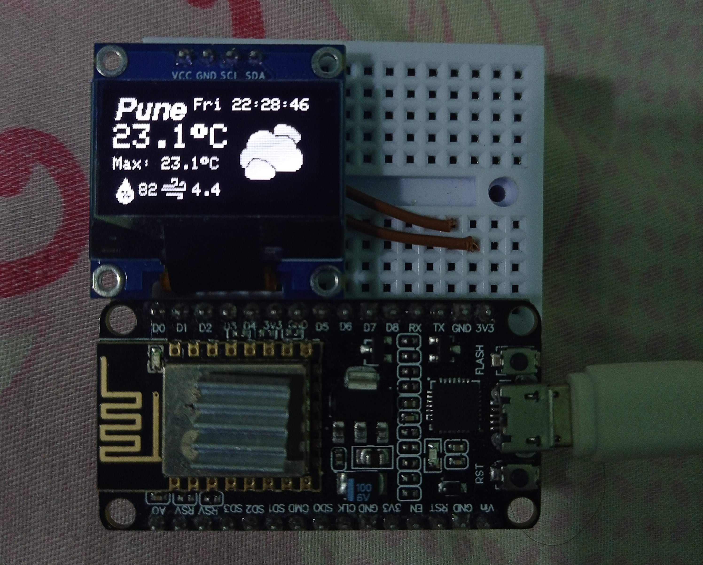

# ESP8266_weather_reporter
IOT project using the NodeMCU esp8266 to gather weather data from https://openweathermap.org/ and displaying it on the OLED 128x64 display.\

# Openweathermap for current weather data
A free API key is provided when you create a free Openweathermap account which has few limitations but does the work. The account sign-up is free. The API keys can be managed on your account.
Access current weather data for any location on Earth including over 200,000 cities! The data is collected and process weather data from different sources such as global and local weather models, satellites, radars and a vast network of weather stations. Data is available in JSON, XML, or HTML format.\

Do refer their API documentation according to your needs. Their guide provides us with vairous ways to make an API call thus making it easier.\
They provide multiple ways of calling:\
  By city name\
  By city ID\
  By geographic coordinates\
  By ZIP code\

# NTP sever for date and time
To get time from an NTP Server, the ESP8266 needs to have an Internet connection and you don’t need additional hardware (like an RTC clock). NTP stands for Network Time Protocol and it is a networking protocol for clock synchronization between computer systems. There are NTP servers like pool.ntp.org that anyone can use to request time as a client. In this case, the ESP8266 is an NTP Client that requests time from an NTP Server https://www.ntp.org/.
